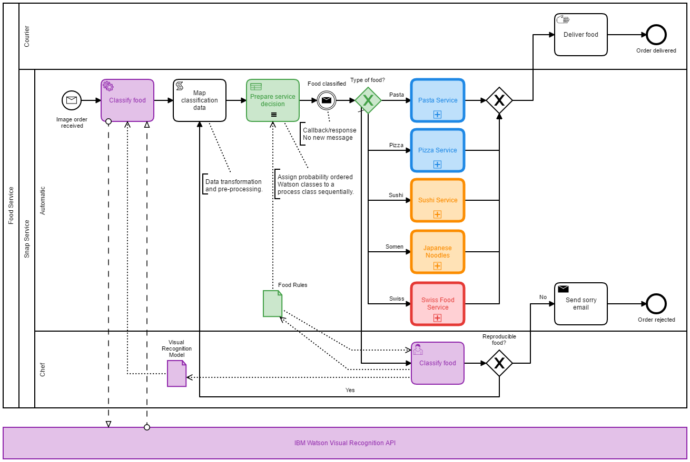

# DigiBP Food Inc. Showcase

This Food Inc. (a fictitious company) showcase contains two exemplary and fictitious scenarios, which were implemented as digitalised processes/workflows. Both scenarios achieve a high degree of digitalisation through the use of AIaaS (Artificial Intelligence as a Service). 

#### Contents:
- [Food Snap Service](#food-snap-service)
    - [Food Snap Process](#food-snap-process)
    - [Implementation](#implementation)
- [Maintainer](#maintainer)
- [License](#license)

## Food Snap Service

The **Food Snap** process showcases how MLaaS (Machine Learning as a Service) can be integrated. In this fictitious scenario, customers can order food by submitting a photo of the desired food. The order should be recognised and forwarded to one of five restaurants which could exist in a multi-restaurant environment available in airports

### Food Snap Process

- Once a food order arrives the `Classify food` service task will invoke the API of [IBM Watson Visual Recognition](https://www.ibm.com/watson/services/visual-recognition) to classify the photo.

### Implementation

#### File Sender

#### Data Transformation

#### 

## Maintainer
- [Digitalisation of Business Processes](https://github.com/digibp)

## License

- [Apache License, Version 2.0](https://github.com/DigiBP/digibp-archetype-camunda-boot/blob/master/LICENSE)